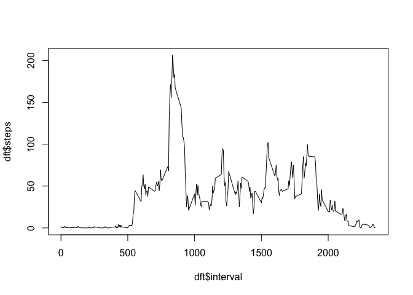
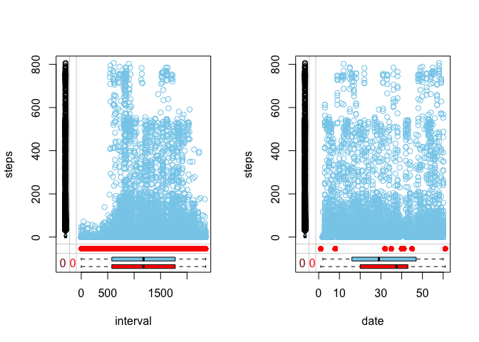
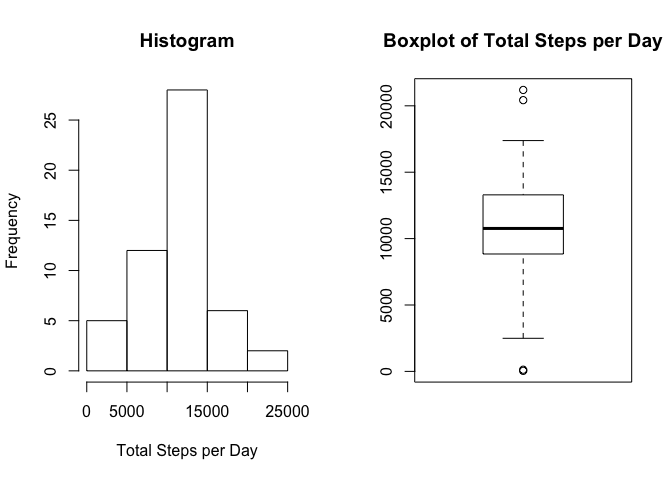
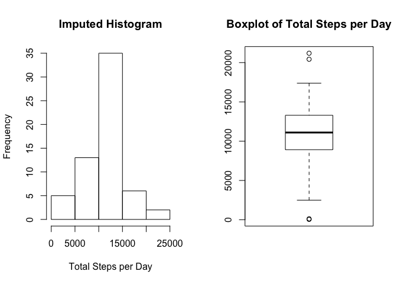
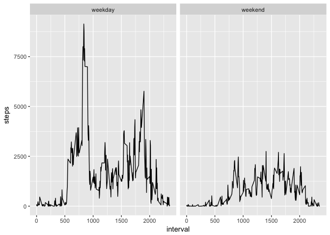

# Reproducible Research: Peer Assessment 1
JeremiShane  


## Loading and preprocessing the data
First step, read in the data file activity.csv

```r
dfa <- read.csv("activity.csv")
str(dfa)  ## quick look at the data
```

```
## 'data.frame':	17568 obs. of  3 variables:
##  $ steps   : int  NA NA NA NA NA NA NA NA NA NA ...
##  $ date    : Factor w/ 61 levels "2012-10-01","2012-10-02",..: 1 1 1 1 1 1 1 1 1 1 ...
##  $ interval: int  0 5 10 15 20 25 30 35 40 45 ...
```
## Libraries
plyr, dplyr, mice, VIM, ggplot2


## What is mean total number of steps taken per day?

```r
dfs <- dfa %>% group_by(date) %>% summarise(steps = sum(steps))
par(mfrow=c(1,2))
hist(dfs$steps, xlab="Total Steps per Day", main="Histogram")
boxplot(dfs$steps, main="Boxplot of Total Steps per Day")
```

<!-- -->

```r
summary(dfs$steps)  ## sum of steps grouped by date
```

```
##    Min. 1st Qu.  Median    Mean 3rd Qu.    Max.    NA's 
##      41    8841   10765   10766   13294   21194       8
```


## What is the average daily activity pattern?
group by time interval and calculate the mean number of steps per interval accross all days

```r
dft <- dfa %>% group_by(interval) %>% summarise(steps = mean(steps, na.rm=TRUE))
par(mfrow=c(1,1))
plot(dft$interval, dft$steps, type="l")  ## time series of steps accross interval
```

<!-- -->

Which time interval on average has the most steps?

```r
dmax <- dft[ dft$steps == max(dft$steps), ]
dmax
```

```
## # A tibble: 1 x 2
##   interval    steps
##      <int>    <dbl>
## 1      835 206.1698
```


## Imputing missing values  
resource reference: https://stats.idre.ucla.edu/r/faq/how-do-i-perform-multiple-imputation-using-predictive-mean-matching-in-r/  

How many missing values do we have?

```r
sum(is.na(dfa$steps))
```

```
## [1] 2304
```

```r
sum(!is.na(dfa$steps))
```

```
## [1] 15264
```

Let's look at the patterns for our missing data.  
The pattern rr represents the number of observations where both pairs of values are observed.  
The pattern rm represents the exact opposite, these are the number of observations where both variables are missing values.  
The pattern mr shows the number of observations where the first variable’s value (e.g. the row variable) is observed and second (or column) variable is missing.  
The pattern mm is just the opposite.  


```r
md.pairs(dfa)
```

```
## $rr
##          steps  date interval
## steps    15264 15264    15264
## date     15264 17568    17568
## interval 15264 17568    17568
## 
## $rm
##          steps date interval
## steps        0    0        0
## date      2304    0        0
## interval  2304    0        0
## 
## $mr
##          steps date interval
## steps        0 2304     2304
## date         0    0        0
## interval     0    0        0
## 
## $mm
##          steps date interval
## steps     2304    0        0
## date         0    0        0
## interval     0    0        0
```

This grid represents the missing data patterns present.  


```r
md.pattern(dfa)
```

```
##       date interval steps     
## 15264    1        1     1    0
##  2304    1        1     0    1
##          0        0  2304 2304
```


Let's visually explore the missing data.  
Under the Missing Completely at Random (MCAR) assumption the red and blue box plots should be identical  
These plots indicate a even distributuion of missing values accross the intervals, but there only seem to be missing values for a limited number of days.  


```r
par(mfrow=c(1,2))
is <- data.frame(interval=dfa$interval, steps=dfa$steps)
ds <- data.frame(date=dfa$date, steps=dfa$steps)
marginplot(is)
marginplot(ds)
```

<!-- -->


Overlap of the boxplots is a good indication of MCAR  
So we can use "mice" package to to predict the missing values.    

MICE (Multivariate Imputation via Chained Equations) is one of the commonly used package by R users. Creating multiple imputations as compared to a single imputation (such as mean) takes care of uncertainty in missing values.  

MICE assumes that the missing data are Missing at Random (MAR), which means that the probability that a value is missing depends only on observed value and can be predicted using them. It imputes data on a variable by variable basis by specifying an imputation model per variable.  

Reference: https://www.analyticsvidhya.com/blog/2016/03/tutorial-powerful-packages-imputing-missing-values/  


```r
set.seed(7)
imp1 <- mice(dfa)  ## default is pmm with m (imputations) = 5
```

```
## 
##  iter imp variable
##   1   1  steps
##   1   2  steps
##   1   3  steps
##   1   4  steps
##   1   5  steps
##   2   1  steps
##   2   2  steps
##   2   3  steps
##   2   4  steps
##   2   5  steps
##   3   1  steps
##   3   2  steps
##   3   3  steps
##   3   4  steps
##   3   5  steps
##   4   1  steps
##   4   2  steps
##   4   3  steps
##   4   4  steps
##   4   5  steps
##   5   1  steps
##   5   2  steps
##   5   3  steps
##   5   4  steps
##   5   5  steps
```

```r
imp1  ## we have five sets of imputed data / 5 imputations
```

```
## Multiply imputed data set
## Call:
## mice(data = dfa)
## Number of multiple imputations:  5
## Missing cells per column:
##    steps     date interval 
##     2304        0        0 
## Imputation methods:
##    steps     date interval 
##    "pmm"       ""       "" 
## VisitSequence:
## steps 
##     1 
## PredictorMatrix:
##          steps date interval
## steps        0    1        1
## date         0    0        0
## interval     0    0        0
## Random generator seed value:  NA
```

Let's see how our imputed data compares to our original data.  

```r
dfs <- dfa %>% group_by(date) %>% summarise(steps = sum(steps))

dfi <- complete(imp1)  ## first imputation
dfsi <- dfi %>% group_by(date) %>% summarise(steps=sum(steps))

par(mfrow=c(1,2))
hist(dfs$steps, xlab="Total Steps per Day", main="Histogram")
boxplot(dfs$steps, main="Boxplot of Total Steps per Day")
```

<!-- -->

```r
summary(dfs$steps)  ## original data
```

```
##    Min. 1st Qu.  Median    Mean 3rd Qu.    Max.    NA's 
##      41    8841   10765   10766   13294   21194       8
```

```r
hist(dfsi$steps, xlab="Total Steps per Day", main="Imputed Histogram")
boxplot(dfsi$steps, main="Boxplot of Total Steps per Day")
```

<!-- -->

```r
summary(dfsi$steps)  ## first imputation
```

```
##    Min. 1st Qu.  Median    Mean 3rd Qu.    Max. 
##      41    8918   11101   10948   13294   21194
```

The data are very similar, but we do see an increase in the mean and median for our imputed data.  


## Are there differences in activity patterns between weekdays and weekends?
first we will use our imputed dfi dataset and determine which days are weekdays and which are weekends.  


```r
dfi$weektime <- ifelse(weekdays(as.POSIXct(dfi$date)) %in% c("Saturday", "Sunday"), "weekend", "weekday")
dfw <- dfi %>% group_by(weektime, interval) %>% summarise(steps=sum(steps))
ts <- ggplot(dfw, aes(y=steps, x=interval))
ts <- ts + geom_line() + facet_grid(.~ weektime)
ts
```

<!-- -->

We do see a large spike during the weekdays vs. the weekends, and an overall lower rate of activity on the weekends.  
